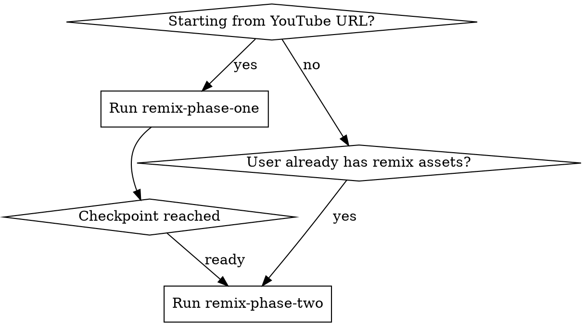

# Remix Full Pipeline

## Overview

This is a thin coordinator for the entire remix workflow. It does not restate the step instructions from the phase skills; it only decides which phase to run, when to pause, and what handoff state must exist.

## When to Use

- User wants the whole flow coordinated end to end
- Work may start from a YouTube URL or from already-available remix assets
- A checkpoint is needed between preparation/remix generation and post-production

## Quick Reference

| Responsibility | Owner |
|---|---|
| Steps 0-4 and optional 5 | `remix-phase-one` |
| Steps 6-9 and optional 7 | `remix-phase-two` |
| checkpoint / delegation / resume logic | this skill |

## Implementation

1. Read `meta.json` when it exists.
2. If the user is starting from source inputs, invoke `remix-phase-one`.
3. Stop at the checkpoint and confirm whether:
   - remix generation was completed,
   - remix assets were supplied directly, or
   - remix assets can be detected in the workspace.
4. Invoke `remix-phase-two` when the handoff contract is satisfied.
5. Summarize completed artifacts and remaining blockers.

Do not duplicate the detailed step-by-step instructions from the phase skills.

## Common Mistakes

| Mistake | Fix |
|---|---|
| Re-documenting every step in this skill | Delegate to the phase skills instead |
| Forcing phase one before checking existing remix assets | Jump straight to `remix-phase-two` when appropriate |
| Losing the checkpoint contract | Explicitly verify handoff assets before phase two |

## Failure Patterns

| Baseline default | Required correction |
|---|---|
| Make phase one include remix selection rigidly | Keep phase one bounded to preparation plus optional Step 5 |
| Assume phase two only starts after a standard Step 5 output | Allow supplied or auto-detected remix assets |
| Expand this skill into a full copy of both phases | Keep this skill thin and delegating |

## Red Flags

- "I should restate the phase steps here for completeness"
- "Phase two cannot start until a selected remix is already recorded"
- "Even with existing remix assets, I should still force phase one first"

If any of these appear, stop and restore the coordinator boundary: delegate, checkpoint, verify handoff, continue.
